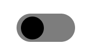

# Challenge #2

Welcome to the Advent of CSS, Day 2!

## Brief
In today’s challenge, we’ll create a CSS only toggle.

## Requirements
Unchecked State



Checked State


For your convenience, here are the HEX colors I'm using:

```
Green - #02ff94
Gray - #7d7d7d
```
