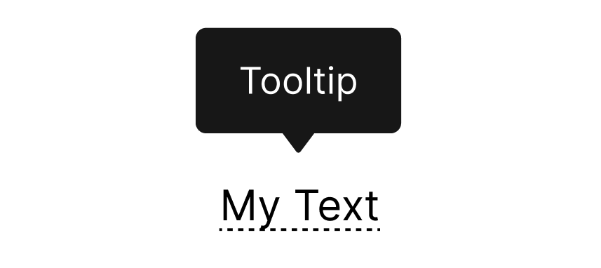

# Challenge #3
Welcome to the Advent of CSS, Day 3!

## Brief
In today’s challenge, we’ll build a CSS only tooltip.

## Requirements
When you hover over the text, the tooltip should appear.

When you roll off the text, the tooltip should disappear.

There are no additional project files today. Everything, including the arrow should be created with CSS.

## Get Started
Happy coding!

Once you’ve finished, share your work using #adventofcss
